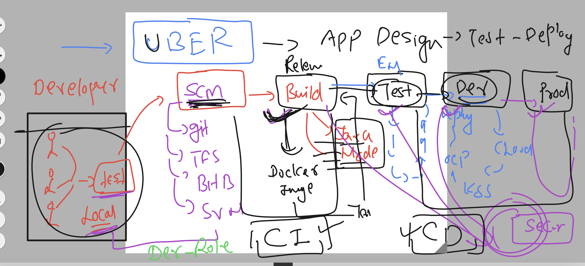
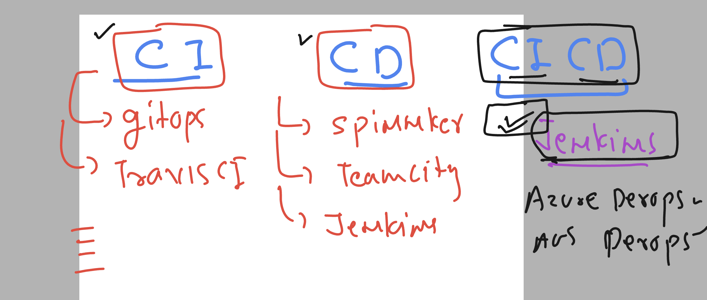
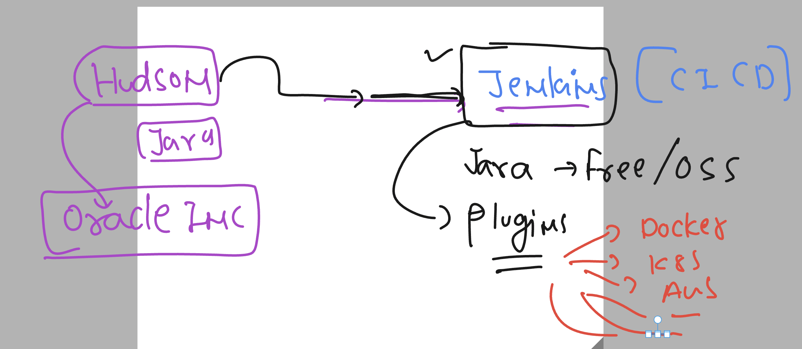

# cloud4c-cicdb3

### Understanding the need of CI & CD 



### list of tools for CICD



### Introducing Jenkins 



### login to your machine and do update

```
 Downloads ssh -i ashu-key.pem   ec2-user@15.207.114.227 

       __|  __|_  )
       _|  (     /   Amazon Linux 2 AMI
      ___|\___|___|

https://aws.amazon.com/amazon-linux-2/
7 package(s) needed for security, out of 8 available
Run "sudo yum update" to apply all updates.
-bash: warning: setlocale: LC_CTYPE: cannot change locale (UTF-8): No such file or directory
[ec2-user@ip-172-31-13-32 ~]$ 
[ec2-user@ip-172-31-13-32 ~]$ 
[ec2-user@ip-172-31-13-32 ~]$ sudo yum update 
Failed to set locale, defaulting to C
Loaded plugins: extras_suggestions, langpacks, priorities, update-motd
amzn2-core                                                                      
```


