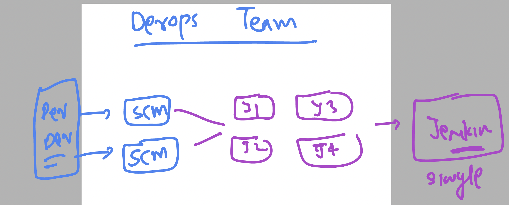
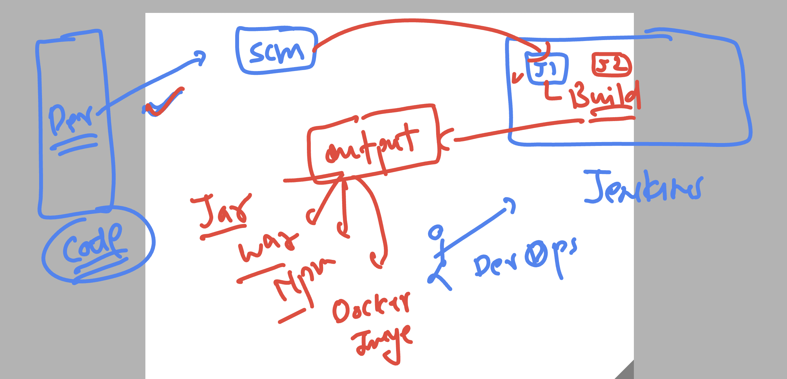
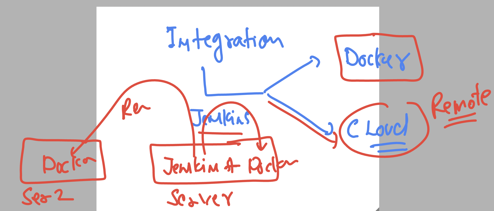
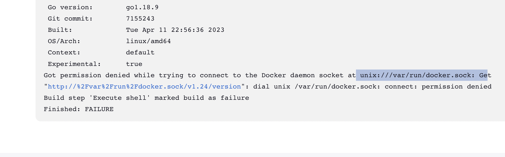
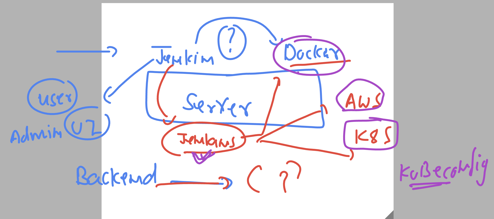
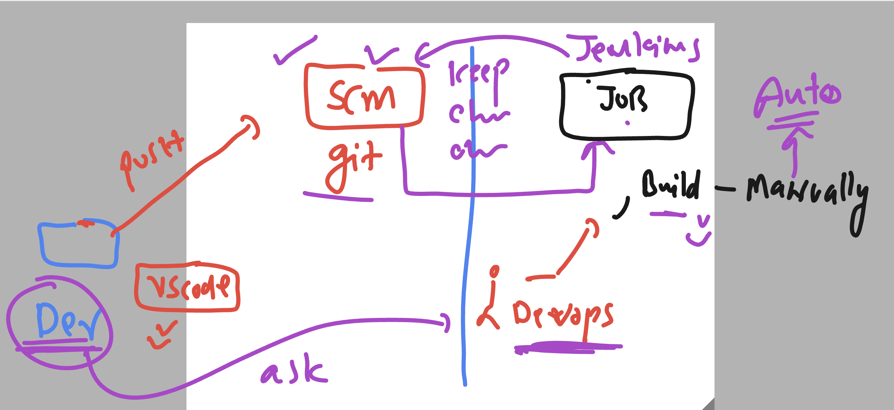
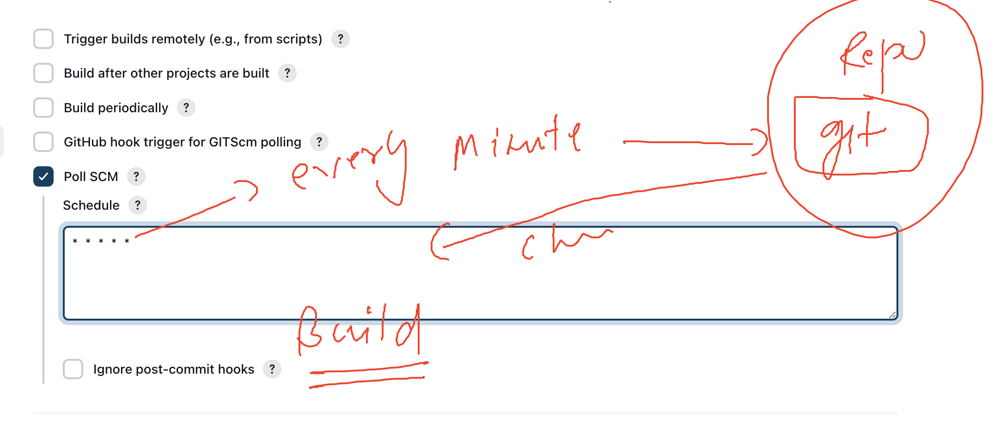
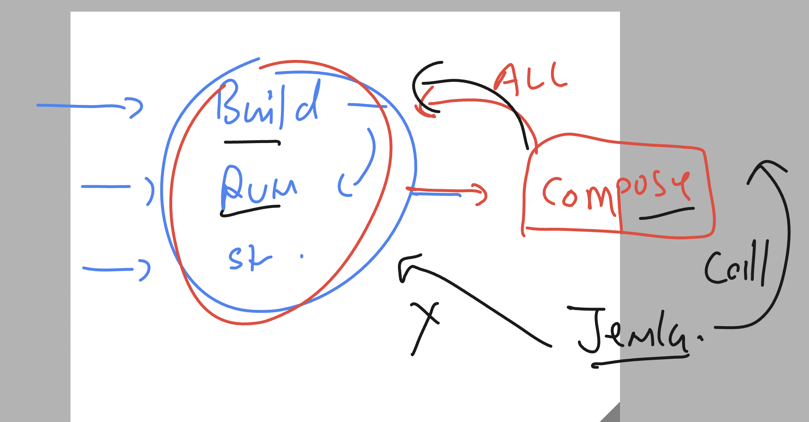

# cloud4c-cicdb3

## Using single server for jenkins job 



### understanding job creation 



### jenkins build and deploy options with docker 



## jenkins + docker on the same system 

### Installing docker 

```
sudo yum install docker -y
```

### starting docker 

```
[ec2-user@ip-172-31-13-32 ~]$ sudo systemctl enable docker 
Created symlink from /etc/systemd/system/multi-user.target.wants/docker.service to /usr/lib/systemd/system/docker.service.
[ec2-user@ip-172-31-13-32 ~]$ sudo systemctl start docker 
[ec2-user@ip-172-31-13-32 ~]$ sudo systemctl status docker 
● docker.service - Docker Application Container Engine
   Loaded: loaded (/usr/lib/systemd/system/docker.service; enabled; vendor preset: disabled)
   Active: active (running) since Thu 2023-08-17 04:09:54 UTC; 3s ago
     Docs: https://docs.docker.com
```

### By default jenkins is not able to connect docker 




### more understanding of jenkins integration 



### adding jenkins backend user to docker group 

```
 sudo usermod -aG docker  jenkins
```

### if you don't want to restart your jenkins service 

```
sudo chmod 777 /var/run/docker.sock
```

### understanding changes and automated build 



### Build trigger using -- poll SCM 



### adding compose file to automated docker steps -- jenkins will call docker-compose 



### compose file

```
version: '3.8'
services:
  ashu-ui-code: # name of app change it 
    image: ashu-web:appv$BUILD_NUMBER
    build:
      context: . # location of dockerfile 
      dockerfile: Dockerfile # name of dockerfile 
    container_name: ashu-web-c1 
    ports:
      - 1234:80 # left side port b/w 1024 - 5000 
```


