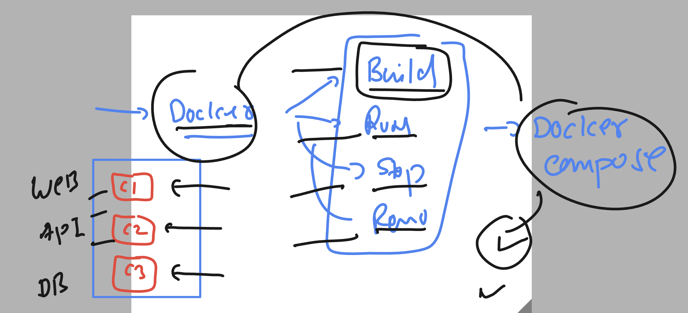
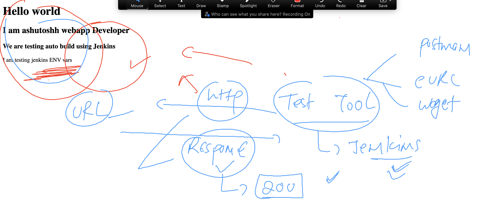
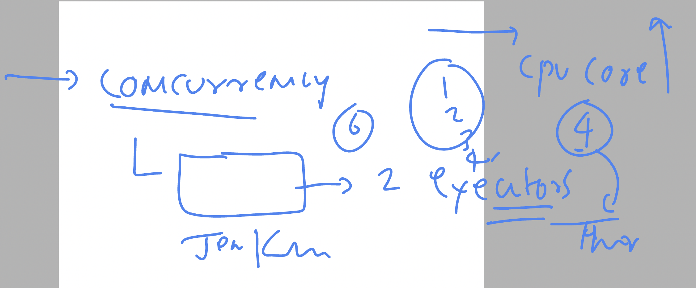
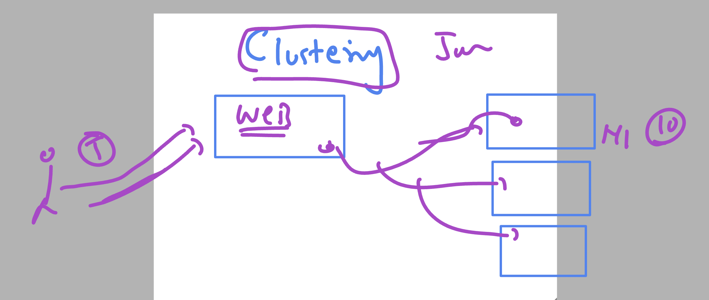

# cloud4c-cicdb3

### docker-compose with jenkins to handle multi container on a single host



### need some testing tool to verify container and its application status 




### Introduction to pipeline jobs


## Web UI app components

### index.html 

```
<!DOCTYPE html>
<html lang="en">
<head>
    <meta charset="UTF-8">
    <meta name="viewport" content="width=device-width, initial-scale=1.0">
    <title>ashu_project</title>
</head>
<body>
    <h1> Hello world </h1>
    <h2> I am ashutoshh webapp Developer </h2>
    <h3> We are testing auto build using Jenkins </h3>
    <p> I am testing jenkins ENV vars </p>
    <b> check below image </b>
    
    
</body>
</html>
```

### health.html 

```
<!DOCTYPE html>
<html lang="en">
<head>
    <meta charset="UTF-8">
    <meta name="viewport" content="width=device-width, initial-scale=1.0">
    <title>health</title>
</head>
<body>
    <h1> This is just for checking health of app </h1>
    
</body>
</html>
```

### Dockerfile

```
FROM nginx
LABEL name="ashutoshh"
COPY .  /usr/share/nginx/html/
EXPOSE 80 

```

### .dockerignore

```
Dockerfile
docker-compose.yaml
.dockerignore
```

### docker-compose.yaml

```
version: '3.8'
services:
  ashu-ui-code: # name of app change it 
    image: ashu-web:appv$BUILD_NUMBER
    build:
      context: . # location of dockerfile 
      dockerfile: Dockerfile # name of dockerfile 
    container_name: ashu-web-c1 
    ports:
      - 1234:80 # left side port b/w 1024 - 5000 
```

## Jenkins executors concept to increase concurrent build 



### jenkins data is stored in 

```
[root@ip-172-31-13-32 ~]# cd /var/lib/jenkins/
[root@ip-172-31-13-32 jenkins]# ls
%C                                                  jenkins.model.JenkinsLocationConfiguration.xml                    queue.xml
config.xml                                          jenkins.mvn.GlobalMavenConfig.xml                                 queue.xml.bak
hudson.model.UpdateCenter.xml                       jenkins.telemetry.Correlator.xml                                  secret.key
hudson.plugins.emailext.ExtendedEmailPublisher.xml  jobs                                                              secret.key.not-so-secret
hudson.plugins.git.GitTool.xml                      logs              
```

### executors and jenkins cluster 




