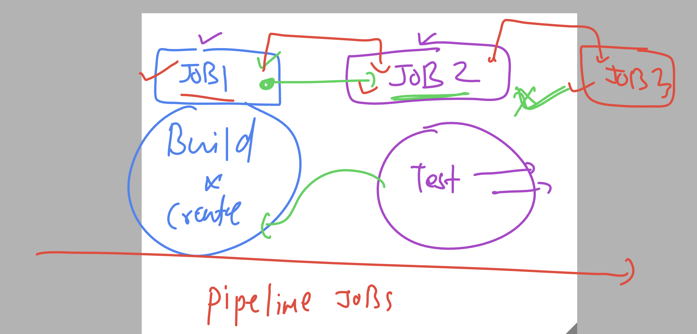

# cloud4c-cicdb3

### docker-compose with jenkins to handle multi container on a single host

### need some testing tool to verify container and its application status 

### Introduction to pipeline jobs

