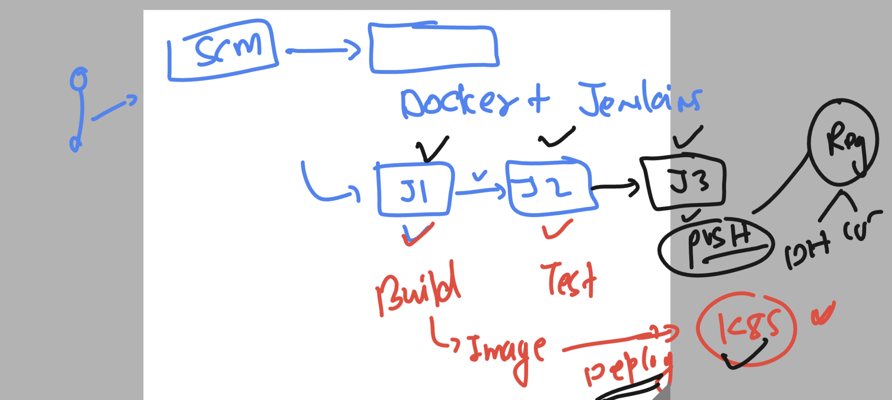
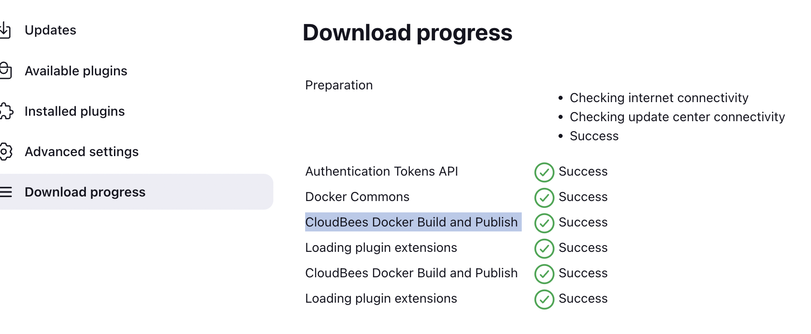
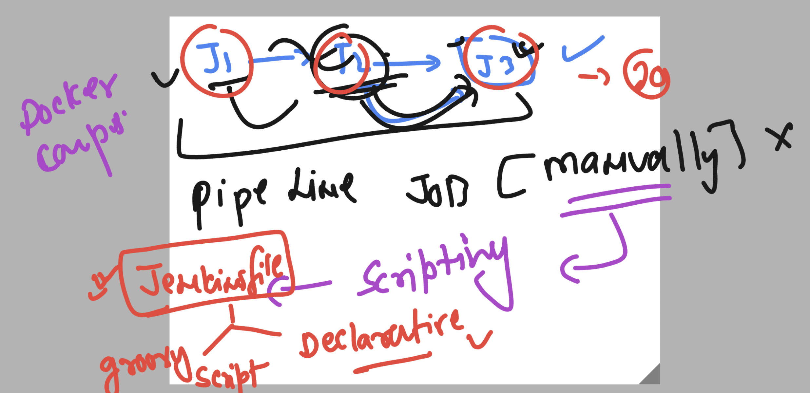
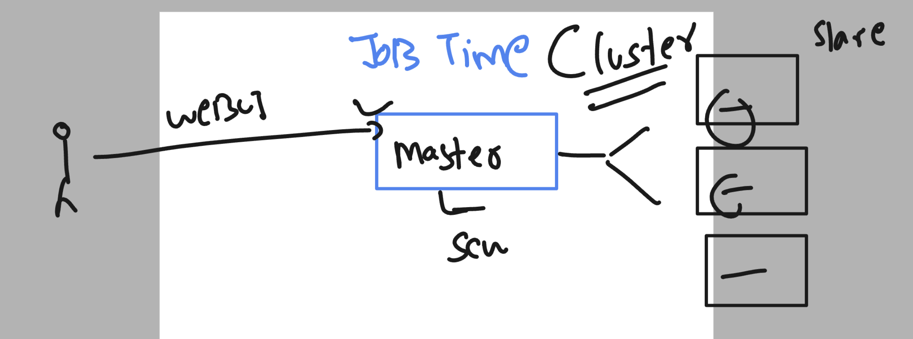

# cloud4c-cicdb3
## Understanding docker image push to hub 

### jenkins plugins for pushing image to docker hub 

## There two problems to solve 

### scripting adopt 

### adopting jenkins cluster methods 

