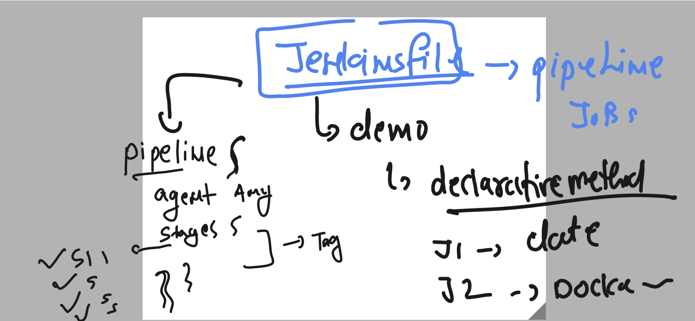

# cloud4c-cicdb3
## Understanding docker image push to hub 


### jenkins plugins for pushing image to docker hub 


## There two problems to solve 

### scripting adopt 


### adopting jenkins cluster methods 


## Creating jenkins cluster --

### master machine is already configured 

### install jdk 11 in both slave machine 

```
 4  sudo yum update
    5  sudo wget -O /etc/yum.repos.d/jenkins.repo  https://pkg.jenkins.io/redhat-stable/jenkins.repo
    6  sudo rpm --import https://pkg.jenkins.io/redhat-stable/jenkins.io-2023.key
 sudo amazon-linux-extras install java-openjdk11 -y
```

### adding a user in both the machine 

```
[root@ip-172-31-0-207 ~]# useradd  cloud4c
[root@ip-172-31-0-207 ~]# 
[root@ip-172-31-0-207 ~]# echo "Cl4c@123"  | passwd cloud4c --stdin 
Changing password for user cloud4c.
passwd: all authentication tokens updated successfully.
[root@ip-172-31-0-207 ~]# systemctl restart sshd
[root@ip-172-31-0-207 ~]# 

```

### format understanding of jenkins file 



### sample 2 stage jenkinsfile using declarative method

```
pipeline {
    agent any

    stages {
        stage('testing with linux command ') {
            steps {
                echo 'Hey all Good morning again '
                sh 'date'
            }
        }
        stage('checking docker images'){
            steps {
                echo 'please wait checking docker images'
                sh 'docker images'
            }
        }
    }
}

```

### creating first single stage pipeline job 

```
pipeline {
    agent any
    // creating stages
    stages{
        // creating first stage for docker compose 
        stage('checking git and doing docker compose'){
            steps {
                echo 'cloning git repo data'
                git 'https://github.com/redashu/cloud4c-jenkins-webapp.git'
                echo 'using docker compose '
                sh 'docker-compose down'
                sh 'docker-compose up -d --build'
                sh 'sleep 2'
                sh 'docker-compose ps'
                echo 'checking personal images'
                sh 'docker-compose images'
            }
            
        }
    }
    
}

```
