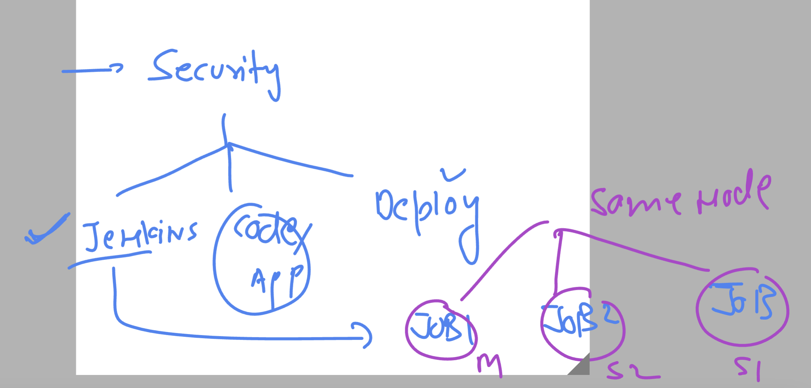

# cloud4c-cicdb3

## Devops --> Devsecops 


### security layers in pipeline



## sample jenkinsfile with custom stage agent 

```
pipeline {
    agent none

    stages {
        stage('Hello') {
            agent {
                label 'slave1-docker'
            }
            steps {
                echo 'Hello World'
                sh 'hostname -i'
            }
        }
        stage('hii'){
            agent {
                label 'master'
            }
            steps {
                echo 'my job is running in master system'
                sh 'date'
            }
        }
    }
}

```
