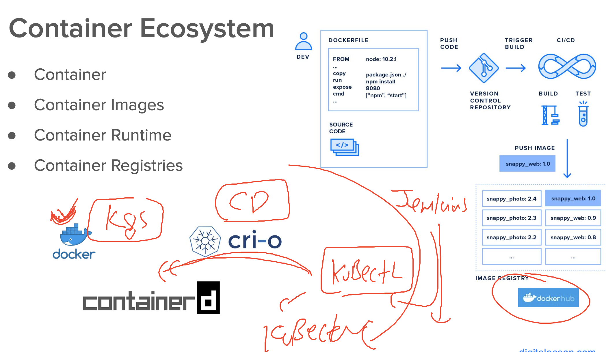

# cloud4c-cicdb3

### Jenkins to k8s 



### adding k8s connect to pipeline

```
pipeline {
    agent {
        label 'master' // manual scheduling
    }

    stages {
        stage('taking source code from git repo') {
            steps {
                echo 'Cloning git repo...'
                checkout scm // This will automatically clone the repo and checkout the appropriate branch
                sh 'ls -a' // Running a Linux command to check the cloned data
            }
        }

        stage('prebuild security check using trufflehog') {
            steps {
                echo 'Scanning GitHub URL for security issues'
                sh 'docker run --rm trufflesecurity/trufflehog:latest github --repo https://github.com/redashu/cloud4c-jenkins-webapp.git >/tmp/ashu-keycheck.txt'
                sh 'grep PRIVATE /tmp/ashu-keycheck.txt'
            }
        }

        stage('using docker-compose to build and run') {
            steps {
                sh 'docker-compose down'
                sh 'docker-compose up -d --build'
                sh 'docker-compose ps'
                sh 'docker-compose images'
            }
        }

        stage('building image using Jenkinsfile way') {
            agent {
                label 'helloslave2'
            }
            steps {
                echo 'Using Jenkinsfile way to build image'
                script {
                    def imageName = "dockerashu/ashu-cloud4c-app"
                    def imageTag = "version$BUILD_NUMBER"
                    docker.build("${imageName}:${imageTag}", "-f Dockerfile .")
                }
                sh 'docker images | grep ashu-cloud4c-app'
            }
        }

        stage('post build security scan') {
            agent {
                label 'helloslave2'
            }
            steps {
                echo 'Scanning build image for vulnerabilities'
                sh 'docker save -o ui-project.tar dockerashu/ashu-cloud4c-app:version$BUILD_NUMBER'
                sh 'trivy image --input ui-project.tar --severity HIGH,CRITICAL >/tmp/ashutest.txt'
                sh 'grep -i High /tmp/ashutest.txt'
            }
        }

        stage('testing') {
            steps {
                echo 'Checking running container status'
                sh 'docker ps | grep -w Up | grep -w ashu-web-c12'
                sh 'curl -f http://localhost:1235/health.html'
            }
        }

        stage('testing k8s apiServer connection') {
            agent any
            steps {
                echo 'Sending REST API request to the Kubernetes master node'
                sh 'kubectl get nodes'
            }
        }
    }

    post {
        success {
            echo 'Sending email to all the teams'
            // Add your code here to send success email
        }
        failure {
            echo 'Checking logs'
            echo 'Sending email to Dev or Sec teams'
            // Add your code here to send failure email
        }
        always {
            echo 'Continuously checking for security improvements'
        }
    }
}

```


